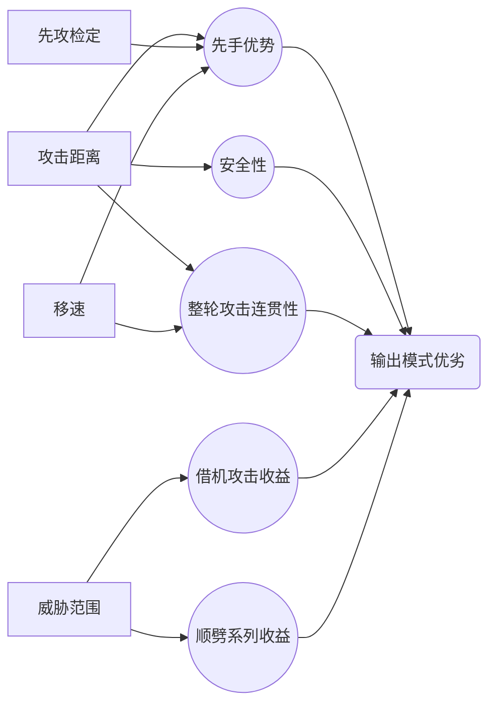

# 正义之怒：肉搏职业数据流测评

**制作者：aaathl  or 唯行**

正义之怒&拥王者的交流群：一群487092507、~~二群：972953691（**推荐**，二群聊游戏比较多）~~、2.5群：191268357

持续更新中—— 有问题或补充可以在群里@我

**GITHUB链接** ---[正义之怒主角BD收录](https://github.com/ZJUZBW/Wotr-BD-LR)

**GITHUB链接** ---[正义之怒物理职业测评](https://github.com/ZJUZBW/WotR-CA)

**GITHUB链接** ---[正义之怒队友BD收录](https://github.com/ZJUZBW/-Wotr-BD-)

**GITHUB链接** ---[拥王者&正义之怒全专长测评](https://github.com/ZJUZBW/Wotr-AofF)

**GITHUB链接** ---[正义之怒施法者入门和进阶手册](https://github.com/ZJUZBW/Wotr-AofS)

**GITHUB链接** ---[【新人向】属性、命中（AB）、防御（AC）和豁免的堆叠及法术对抗](https://github.com/ZJUZBW/Wotr-BUFF)

**百度贴吧**：[【正义之怒不公平战报】【无佣兵无修改】魔能射手+全剧情队友](https://tieba.baidu.com/p/7974312458)

**哔哩哔哩**：[【正义之怒不公平视频录制】【无修改】恶魔法师](https://www.bilibili.com/video/BV1Bu411C7xR)（视频太麻烦了，目前就更新到第二章虫群女王之前，而且版本比较旧了，上面的文字战报思路和教学性更好，可以结合观看）

**百度网盘**：https://pan.baidu.com/s/15jx_JzQDWn4_kcxlLRdegg 提取码：wotr，【注：不会实时更新】

## 目录（网页显示不了就到网盘下载）

[TOC]

## 测评的前提条件

只计算到前13级+神话4的数据，用于表示职业的前中期强度，至于13级以后，基本上都是成型了，如果还不能开启无双割草模式，那也太”后期“了。

**这里特意说明一下**：双手大力哥特指点出借机流+顺势斩系列的力系长柄武器持用者。

### 关于回合制和即时制

### 关于BUG和房规

**原则上排除一切BUG，因为我没精力去实际测试全体职业和各种装备的适配性，也没这个必要去计算这些奇奇怪怪的BUG及其组合效果。而且不基于BUG，也就不用考虑游戏版本更新以后BUG修复带来的后续影响。**

BUG的定义：程序设计之外的错误。这里说的BUG是指与描述和设计意图不符合，产生了意料之外的其他增强或削弱效果---比如地狱烈焰射线的1.5倍伤害，附伤叠加之类。

房规的定义：跟桌面规则不符合，但是跟游戏里的描述一致，或者游戏里没有对此有特殊说明 --- 比如歌者、原怒者可以用专长选狂暴特技；比如自然低语和鳞拳魅上防叠加。

**这里有几个特例**：部分天生防御加值叠加（目前是来源于法术的天生防御取最高，其他的可以叠）、行动自如免疫知命的恍惚、动物伙伴属性跟选择界面的描述不符，这些还是默认保留。

**排除的BUG如下**：

1. 排除附伤叠加BUG --- 比如巨灵化身附带正义烙印、神圣公正破敌附魔的效果。
2. 排除要害打击、奋力冲锋和重击伤害等伤害乘算的BUG。
3. 排除变形效应叠加（多个巨灵化身）和体型效应叠加（比如伟岸+缩小）的BUG。
4. 排除两种武器训练叠加，多来源宿敌叠加，永饥寿衣、圣兽之爪的增强加值叠加的BUG。
5. 排除享受队友的视如仇寇的BUG。
6. 排除研究目标第一次攻击成功偷袭目标以后没有附加研究目标伤害的BUG。
7. 排除狐人变形BUG---这个已经修复了
8. 排除魔化武器、高等魔化武器跟武器原本加值叠加的BUG---跟TTT保持一致。排除魔牙和高等魔牙叠加的BUG。
9. 武僧拳头和天生武器不吃武器附魔的BUG --- 1.2版本狗子可以用圣战之刃打附伤了。
10. 啮咬攻击次数叠加的BUG，还有单天武动物伙伴变形以后的攻击次数极大增加的BUG。
11. 光能附魔效果可以跟空间斩叠加，也就是说敌人的接触防御的基础上，还要再减去一次盔甲类加值（护盾术、法师护甲、防御护腕、盔甲、魔化防具、盾牌/盔甲专攻之类）
12. 其他没举例的奇奇怪怪的或修复或者没修复的BUG，比如双持念刃，念袭要害打击等。

### 游戏里有几个机制说明

1. 免疫精准伤害，护命这些，效果都是免疫偷袭造成的额外伤害，但是还是偷袭敌人，可以对其上研究目标和错乱之创。
2. 护命可以有概率免疫重击和偷袭造成的额外伤害，~~但是你重击了队友还是可以通过包抄或者抓准时机对其借机攻击的~~（改了，现在无了）。只有免疫重击的敌人才可以无视重击威胁---就算骰20也不会进入重击确认那一步。
3. 幽冥附魔或者通过灵魂之灾将伤害转为力场，可以破虚体的免疫重击和~~免疫精准伤害~~（免疫精准伤害的部分不再能通过转伤害类型绕过了）。

## 评价标准

### 输出模式优劣

#### 攻击距离优势

1. 有的攻击方式在大部分情况下都可以实现整轮攻击，比如远程的输出环境就显著优于近战，基本上随时都在进行整轮攻击，而近战就要跟敌人贴脸才能攻击，就算在即时制下，远程也很容易实现先输出一轮，敌人在队友近战近身之前就死亡了。
2. 考虑到大部分敌人的攻击距离（普通武器+大体型共10尺；大砍刀/长矛/新月战斧+中体型共10尺），基本上15尺攻击距离才可以保证有安全的输出环境。
3. 攻击距离越大，在先攻和突袭轮的时候可以越早开始输出，此时敌人处于措手不及状态（除非有直觉闪避、类似直觉闪避的能力或预警），攻击也是几乎是必中的。

**攻击距离评级**（仅供参考）

| 评级 | 攻击距离   | 攻击模式举例（以下默认基础体型为中型，默认即时制，回合制会有特殊说明） |
| ---- | ---------- | ------------------------------------------------------------ |
| S+++ | 坐骑移速×2 | 回合制下的骑乘攻击模式                                       |
| S    | 50尺       | 长弓、弩                                                     |
| A    | 30-40尺    | 短弓，开启近程射击的长弓、弩；**特例**：飞斧弹道速度极慢，记为C（回合制不变） |
| B    | 25尺       | 伟岸雄姿+长柄武器+自带5触及范围的职业（比如血怒者蛇血）；伟岸雄姿+骑乘+长柄武器 |
| C    | 20尺       | 伟岸雄姿+长柄武器 或 变巨术+长柄武器+自带5触及范围的职业（比如血怒者蛇血）；变巨术+骑乘+长柄武器 |
| D    | 15尺       | 变巨术+长柄武器 或 伟岸雄姿；骑乘+长柄武器 或 变巨术+骑乘    |
| E    | 10尺       | 变巨术 或 长柄武器 或 骑乘                                   |
| F    | 5尺        | 中体型或更小，游戏里最小触及范围就是5尺。                    |

**特例**：有猛扑的职业，攻击距离评定为A；回合制下骑乘职业，坐骑移动后骑者还可以整轮攻击，攻击完成后还能移动，优势很大。

#### 先攻检定优势

- 有的职业先攻极高，无论是否为突袭轮，都能等效于比其他先攻低的职业多输出1/N轮（即时制N≥6/5 ---先攻检定后，最早1s后出手、最晚6s后出手；回合制N＞1）。简单理解就是即时制你最多相当于多输出5秒，回合制最多相当于比敌人多了1轮的输出，由此可以先把棘手的敌人迅速解决。
- 突袭轮+先攻优势下，大部分敌人陷入措手不及状态---除非敌人有直觉闪避/预警术，对于正常队伍来说都是相当于有攻击必中+造成偷袭的效果，在前中期buff不多的情况下，效果特别明显。
- 对于大部分战斗持续时间在3轮以下的战斗影响非常大，同样时间内，别人输出3轮而你输出了4轮。

**考虑先攻的收益，必须先考虑敌人的先攻来源是什么？**

- 敏捷调整值。
- 额外属性上先攻（极少数有职业的神话恶魔，比如取乐的黑暗有先觉斗士等级，还有的敌人有审判官等级）
- 精通先攻，这个大部分稍微不那么杂鱼的敌人都会有。
- 精通先攻（神话），这个只有神话10的敌人才有。
- 其他，比如苍白女士有卡丽斯翠的祝福+12先攻。

不公平难度下，大部分敌人的先攻为第1章6-12，第2、3章10-18，第4、5、6章14-27左右，少部分敌人的先攻会在此基础上附加10-16点先攻（类似阳锤这种50+先攻的极特例不再考虑范围）。

**有先攻骰必20的情况下，先攻大概达到38左右即可在不公平难度下实现绝对先攻（100%先攻），即永远比对手多5/6轮输出（早5秒输出=多打5秒）；而如果不是的话，要51点以上的先攻才能保证有96.25%以上的概率才能保证第一个出手（这里假设敌人的先攻最高者比次高者多6点先攻，因为BOSS属性远超旁边的杂鱼）。**

| 评级 | 先攻数值                      | 具体职业举例（表格内未考虑敏捷和背景）                       |
| ---- | ----------------------------- | ------------------------------------------------------------ |
| EX   | 先攻骰必20+职业增加10先攻左右 | 19级剑圣、20级预言学派法师、20级僧兵                         |
| S    | 职业额外增加16先攻            |                                                              |
| A+   | 职业额外增加14先攻            | 野兔魔宠的预言法师                                           |
| A    | 职业额外增加12先攻            | 先觉斗士、知命诅咒 + 战斗域-洞悉战局的先知（常驻金鹰之魂后） |
| B+   | 职业额外增加10先攻            | 剑圣、审判官、僧兵、预言学派法师                             |
| B    | 职业额外增加8先攻             | 战斗域-洞悉战局的先知（常驻金鹰之魂后）、进阶武训-枕戈待旦的突变斗士 |
| C+   | 职业额外增加6先攻             | 进阶武训-枕戈待旦的战士、战斗域-洞悉战局的先知               |
| C    | 职业额外增加4先攻             | 有野兔魔宠的职业（杀手、游荡者、法师、巫师等）               |
| D    | 职业额外增加0先攻             | 其他几乎全部职业                                             |

**特别注意**：

- 这里假设职业的先攻成长为线性，只考虑永驻或者持续时间为24H的能力。
- 额外属性加先攻等效增加10先攻。
- 在先攻至少高于敌人1点的情况下，先攻双骰取高视为4点先攻，三骰取高视为6点先攻。
- 基础默认为12-14敏；主敏（满级24敏）视为加1级；副敏（16-18敏）视为加0.5级；

**堆先攻的手段**：

- 精通先攻和神话精通先攻，视为堆先攻职业的必选，默认队伍里均有【领袖感召】。
- 堆先攻的装备为<夜空闪>+5，<风宗头盔>+4，<快速应敌护符>+4，<启明星戒指>+4，<风之气息>+4，<无可辩驳眼镜>+2
- 堆先攻的背景为扒手，+2先攻
- 堆先攻的法术为金鹰之魂，+2先攻

#### 移速优势

注：这条回合制里效果更明显。

回合制里的攻击还需要考虑移动速度，因为一个移动动作最多移动你的|移速|的距离。所以回合制近战移速低于60都记为不合格，速度越高越好。基本上可以记为，没加速术之前，没自带脚底抹油的菜刀职业都是不合格的。有加速术以后，穿甲降10移速的职业也是不合格的。即时制同理。

#### 威胁范围优劣

近战武器的威胁范围即攻击范围；威胁范围越大越厉害，因为威胁范围关系到你能参与的借机攻击数量以及顺势斩、终势斩攻击到的敌人数量。但是对于T来说，威胁范围太大也不太好，这样敌人离开你去后排了也借机不了，拉不住仇恨。一般来说，前排威胁范围最好还是有个阶梯型，比如B+C+D，B+D+D，A+C+D之类，这样打起来阵容更有层次感，敌人也更容易吃到借机攻击。

| 评级 | 攻击距离 | 攻击模式举例（以下默认基础体型为中型）                       |
| ---- | -------- | ------------------------------------------------------------ |
| S    | 25尺     | 伟岸雄姿+长柄武器+自带5触及范围的职业（比如血怒者蛇血）；3级趁隙射击+伟岸雄姿；伟岸雄姿+骑乘+长柄武器 |
| A    | 20尺     | 伟岸雄姿+长柄武器 或 变巨术+长柄武器+自带5触及范围的职业（比如血怒者蛇血）；3级趁隙射击+变巨术；变巨+骑乘+长柄武器 |
| B    | 15尺     | 变巨术+长柄武器 或 伟岸雄姿 或 3级趁隙射击；变巨+骑乘 或者 长柄武器+骑乘 |
| C    | 10尺     | 变巨术 或 长柄武器 或 骑乘                                   |
| D    | 5尺      | 中体型或更小，游戏里最小触及范围就是5尺。                    |

### 通用队伍和通用BUFF

通用队伍即为1个九环法师（无学派）+1个九环牧师（无领域），通用buff即九环法师和九环牧师可以提供的buff。

### 常态、极限I、极限II状态

**常态**：队友给通用分钟级buff+自身分钟级buff和分钟级能力（例外：野蛮人狂暴和诗人/歌者的歌也算）所能达成的常态。

> 【注：对于自身的非分钟级buff和能力，如果多次使用可以实现持续时间大于分钟级BUFF---（即每等级持续1分钟，也是5个延时加速术） 或 随时开关不会在赶路的时候浪费持续时间---比如狂暴，也视为常态】
>

**极限I**：在常态的基础上，用自身轮级buff和队友给的轮级buff所能达成的状态（比如队友给高等隐形术、祈祷术、荣光爆发之类）。这里包括夹击、包抄。

**极限II**：在极限I的基础上，自己在使用每天一次或几次的持续时间极短的能力所能达成的状态，比如烛台守卫、圣洁幸运之类。

### 完备度

表示达到常态、极限I、极限II，需要依赖队友多少个通用BUFF的支持。

使用队友N个BUFF以达到某种状态A，记为（A|N）。

### 装备栏依赖度

某个装备栏只能放特定装备：比如战士的手套栏必备<（次级）决斗手套/剑师之赐>，对战士来说确实强化了战力，但是其他职业的手套位也可以装备<剑师之赐>/<精准手套>/<刺绣手套>（+3AC和全豁免）/<送亡者手套>（+1d6偷袭骰）/<诡诈烈焰>。比如武僧可以穿<秩序长袍>，但是其他职业可以穿<招摇撞骗>，效果其实不差。又比如头盔位置，狂暴职业可以用<恶魔愤恨>，但是事实上<含羞百合>显然更强。当然如果考虑到装备分配的话，能穿一些特定的装备也扩大了装备池，提高了装备利用率。

### 支援能力

即维持自身基本战力的同时，给队友的额外支援，包括法术位（比如加速术、祈祷术、高等隐形术）和职业能力（比如歌者的狂暴战歌、审判官领域）。

### 通用开卡

人类种族，主力就是19力量开局，主敏就是19敏开局

### 通用战斗系专长和专长优先级

#### 专长优先级

**远程**：远程系列＞熟练偷袭者和致命瞄准（特殊职业除外）＞精通先攻> 精通重击＞粉碎防御系列=借机流＞战士专长系列

**双持**：双持系列＞AB转换为伤害的专长（偷袭类职业除外）＞借机流＞精通先攻＞粉碎防御系列＞其他必要专长 = 战士专长系列

**双手**：猛力攻击＞顺势斩系列 ≥ 借机流 ＞精通先攻＞粉碎防御系列 = 其他必要专长 = 战士专长系列

**天生武器**：因为强度基于BUG ---啮咬叠加，不考虑这个BUG的话，天生武器实在是弱的可怜（指上限），不做评价。

#### 通用战斗系专长汇总

借机流：包抄、精通重击，目前战斗反射和抓准时机如果专长点不出则不强求（但是有一人成军/独行战术的大力哥还是必出的）

**双手**顺势斩系列：顺势斩、强力顺势斩、终势斩、精通终势斩

**双持**系列：双武器战斗、精通双武器战斗、高等双武器战斗，双斩

**远程**系列：近程射击、精准射击、快速射击、多重射击

粉碎防御系列：武器专攻、炫目武技（双手游侠/杀手可以无视这个先决条件）、粉碎防御

AB转换为伤害的专长：猛力攻击，食人鱼打击、致命瞄准

战士专长系列：高等武器专攻，（高等）武器专精

敏系额外专长：武器娴熟（游荡者会送），优雅挥砍/优雅刺击

其他必要专长：精通先攻，熟练偷袭者，奥术打击（原怒者血脉送，其他人不选）

### 武器和装备

| 等级  | 武器   | 腰带                        |      |      |
| ----- | ------ | --------------------------- | ---- | ---- |
| 1-3   | 精制品 | 无                          |      |      |
| 4-6   | +1     | 无                          |      |      |
| 7-10  | +2     | 8级后+4巨力腰带和+2敏捷腰带 |      |      |
| 11-13 | +3     | +6力敏腰带                  |      |      |

## 次要评价标准

豁免、AC、血量和免疫，不会给详细的数据，只是给个大概的描述。

有动物伙伴骑乘的，AC评价均为优秀，且视为常驻夹击和包抄（7级后，或者 有马+共享团队专长/独行战术之后 --- 比如猎人和审判官），回合制的装备默认用出双入对。

## 武器模板

根据下表可以得出几个结论：

1. **单次攻击伤害模板**：力双手＞敏双手/力双持＞敏单持＞敏双持＞远程；
2. 在伟岸雄姿之前，伤害对比大概为：力双手 = 敏双手+4.5 = 力双持+6 =  敏单持+9 = 敏双持+10.5 = 远程+13.5
3. 在伟岸雄姿之后，伤害对比大概为：力双手 = 力双持+8 = 敏双手+12 =  敏单持+16.5 = 敏双持+18= 远程+22.5
4. 以上并未考虑猛力攻击、致命瞄准和食人鱼打击的收益，双手猛力攻击是 1AB 换3伤害（有神话以后是换5），其他的则是 1AB 换2伤害（有神话以后是换3）。

**力双手模板** ---标准武器为1d10，斩矛

​	**未计入表格部分**：夹击+2AB

| 等级 | AB   | 伤害   | 伤害期望 | 所需BUFF         | 力量调整值 | 武器骰 | 体型调整值 | 武器加值 |
| ---- | ---- | ------ | -------- | ---------------- | ---------- | ------ | ---------- | -------- |
| 1    | 5    | 2d8+7  | 16       | 变巨术           | 21（5）    | 2d8    | -1         | 精制品   |
| 2    | 5    | 2d8+7  | 16       | 变巨术           | 21（5）    | 2d8    | -1         | 精制品   |
| 3    | 7    | 2d8+10 | 19       | 变巨术，牛之蛮力 | 25（7）    | 2d8    | -1         | 精制品   |
| 4    | 8    | 2d8+13 | 22       | 变巨术，牛之蛮力 | 26（8）    | 2d8    | -1         | +1       |
| 5    | 8    | 2d8+13 | 22       | 变巨术，牛之蛮力 | 26（8）    | 2d8    | -1         | +1       |
| 6    | 8    | 2d8+13 | 22       | 变巨术，牛之蛮力 | 26（8）    | 2d8    | -1         | +1       |
| 7    | 9    | 2d8+14 | 23       | 变巨术，牛之蛮力 | 26（8）    | 2d8    | -1         | +2       |
| 8    | 9    | 2d8+14 | 23       | 变巨术，牛之蛮力 | 27（8）    | 2d8    | -1         | +2       |
| 9    | 9    | 2d8+14 | 23       | 变巨术           | 27（8）    | 2d8    | -1         | +2       |
| 10   | 9    | 2d8+14 | 23       | 变巨术           | 27（8）    | 2d8    | -1         | +2       |
| 11   | 11   | 2d8+16 | 25       | 变巨术           | 29（9）    | 2d8    | -1         | +3       |
| 12   | 12   | 2d8+18 | 27       | 变巨术           | 30（10）   | 2d8    | -1         | +3       |
| 13   | 13   | 3d8+21 | 34.5     | 伟岸雄姿         | 34（12）   | 3d8    | -2         | +3       |

**敏双手模板** ---标准武器为1d10，精灵曲刃

​	**未计入表格部分**：夹击+2AB

【注：最早3级敏上伤，最晚是8级+神话2才能实现敏上伤；且序章最多3级，主角敏菜刀没猫之轻灵，除非主角自己是法师】

| 等级 | AB   | 伤害   | 伤害期望 | 所需BUFF         | 敏捷调整值 | 武器骰 | 体型调整值 | 武器加值 |
| ---- | ---- | ------ | -------- | ---------------- | ---------- | ------ | ---------- | -------- |
| 1    | 7    | 1d8    | 4.5      | 缩小术           | 21（5）    | 1d8    | +1         | 精制品   |
| 2    | 7    | 1d8    | 4.5      | 缩小术           | 21（5）    | 1d8    | +1         | 精制品   |
| 3    | 7    | 1d8+7  | 11.5     | 缩小术           | 21（5）    | 1d8    | +1         | 精制品   |
| 4    | 10   | 1d8+13 | 17.5     | 缩小术，猫之轻灵 | 26（8）    | 1d8    | +1         | +1       |
| 5    | 10   | 1d8+13 | 17.5     | 缩小术，猫之轻灵 | 26（8）    | 1d8    | +1         | +1       |
| 6    | 10   | 1d8+13 | 17.5     | 缩小术，猫之轻灵 | 26（8）    | 1d8    | +1         | +1       |
| 7    | 11   | 1d8+14 | 18.5     | 缩小术，猫之轻灵 | 26（8）    | 1d8    | +1         | +2       |
| 8    | 11   | 1d8+14 | 18.5     | 缩小术，猫之轻灵 | 27（8）    | 1d8    | +1         | +2       |
| 9    | 11   | 1d8+14 | 18.5     | 缩小术，猫之轻灵 | 27（8）    | 1d8    | +1         | +2       |
| 10   | 11   | 1d8+14 | 18.5     | 缩小术，猫之轻灵 | 27（8）    | 1d8    | +1         | +2       |
| 11   | 13   | 1d8+16 | 20.5     | 缩小术，猫之轻灵 | 29（9）    | 1d8    | +1         | +3       |
| 12   | 14   | 1d8+18 | 22.5     | 缩小术           | 30（10）   | 1d8    | +1         | +3       |
| 13   | 14   | 1d8+18 | 22.5     | 缩小术           | 30（10）   | 1d8    | +1         | +3       |

**力双持模板** ---主手和副手可以不一致，所以统一当成1d8计算，双持 -2AB；

​	**未计入表格部分**：夹击+2AB

| 等级 | AB   | 伤害   | 伤害期望 | 所需BUFF         | 力量调整值 | 武器骰 | 体型调整值 | 武器加值 |
| ---- | ---- | ------ | -------- | ---------------- | ---------- | ------ | ---------- | -------- |
| 1    | 3    | 2d6+5  | 12       | 变巨术           | 21（5）    | 2d6    | -1         | 精制品   |
| 2    | 3    | 2d6+5  | 12       | 变巨术           | 21（5）    | 2d6    | -1         | 精制品   |
| 3    | 5    | 2d6+7  | 14       | 变巨术，牛之蛮力 | 25（7）    | 2d6    | -1         | 精制品   |
| 4    | 6    | 2d6+9  | 16       | 变巨术，牛之蛮力 | 26（8）    | 2d6    | -1         | +1       |
| 5    | 6    | 2d6+9  | 16       | 变巨术，牛之蛮力 | 26（8）    | 2d6    | -1         | +1       |
| 6    | 6    | 2d6+9  | 16       | 变巨术，牛之蛮力 | 26（8）    | 2d6    | -1         | +1       |
| 7    | 7    | 2d6+10 | 17       | 变巨术，牛之蛮力 | 26（8）    | 2d6    | -1         | +2       |
| 8    | 7    | 2d6+10 | 17       | 变巨术，牛之蛮力 | 27（8）    | 2d6    | -1         | +2       |
| 9    | 7    | 2d6+10 | 17       | 变巨术           | 27（8）    | 2d6    | -1         | +2       |
| 10   | 7    | 2d6+10 | 17       | 变巨术           | 27（8）    | 2d6    | -1         | +2       |
| 11   | 9    | 2d6+12 | 19       | 变巨术           | 29（9）    | 2d6    | -1         | +3       |
| 12   | 10   | 2d6+13 | 20       | 变巨术           | 30（10）   | 2d6    | -1         | +3       |
| 13   | 11   | 3d6+15 | 25.5     | 伟岸雄姿         | 34（12）   | 3d6    | -2         | +3       |

**敏双持模板** ---标准武器为反曲刀，1d4，双持-2AB

​	**未计入表格部分**：夹击+2AB

| 等级 | AB   | 伤害   | 伤害期望 | 所需BUFF         | 敏捷调整值 | 武器骰 | 体型调整值 | 武器加值 |
| ---- | ---- | ------ | -------- | ---------------- | ---------- | ------ | ---------- | -------- |
| 1    | 5    | 1d4    | 2.5      | 缩小术           | 21（5）    | 1d4    | +1         | 精制品   |
| 2    | 5    | 1d4    | 2.5      | 缩小术           | 21（5）    | 1d4    | +1         | 精制品   |
| 3    | 5    | 1d4+5  | 7.5      | 缩小术           | 21（5）    | 1d4    | +1         | 精制品   |
| 4    | 8    | 1d4+9  | 11.5     | 缩小术，猫之轻灵 | 26（8）    | 1d4    | +1         | +1       |
| 5    | 8    | 1d4+9  | 11.5     | 缩小术，猫之轻灵 | 26（8）    | 1d4    | +1         | +1       |
| 6    | 8    | 1d4+9  | 11.5     | 缩小术，猫之轻灵 | 26（8）    | 1d4    | +1         | +1       |
| 7    | 9    | 1d4+10 | 12.5     | 缩小术，猫之轻灵 | 26（8）    | 1d4    | +1         | +2       |
| 8    | 9    | 1d4+10 | 12.5     | 缩小术，猫之轻灵 | 27（8）    | 1d4    | +1         | +2       |
| 9    | 9    | 1d4+10 | 12.5     | 缩小术，猫之轻灵 | 27（8）    | 1d4    | +1         | +2       |
| 10   | 9    | 1d4+10 | 12.5     | 缩小术，猫之轻灵 | 27（8）    | 1d4    | +1         | +2       |
| 11   | 11   | 1d4+12 | 14.5     | 缩小术，猫之轻灵 | 29（9）    | 1d4    | +1         | +3       |
| 12   | 12   | 1d4+13 | 15.5     | 缩小术           | 30（10）   | 1d4    | +1         | +3       |
| 13   | 12   | 1d4+13 | 15.5     | 缩小术           | 30（10）   | 1d4    | +1         | +3       |

**敏单持模板** ---标准武器为穿甲剑，2d4

​	**未计入表格部分**：夹击+2AB

| 等级 | AB   | 伤害   | 伤害期望 | 所需BUFF         | 敏捷调整值 | 武器骰 | 体型调整值 | 武器加值 |
| ---- | ---- | ------ | -------- | ---------------- | ---------- | ------ | ---------- | -------- |
| 1    | 7    | 1d6    | 4        | 缩小术           | 21（5）    | 2d3    | +1         | 精制品   |
| 2    | 7    | 1d6    | 4        | 缩小术           | 21（5）    | 2d3    | +1         | 精制品   |
| 3    | 7    | 1d6+5  | 9        | 缩小术           | 21（5）    | 2d3    | +1         | 精制品   |
| 4    | 10   | 1d6+9  | 13       | 缩小术，猫之轻灵 | 26（8）    | 2d3    | +1         | +1       |
| 5    | 10   | 1d6+9  | 13       | 缩小术，猫之轻灵 | 26（8）    | 2d3    | +1         | +1       |
| 6    | 10   | 1d6+9  | 13       | 缩小术，猫之轻灵 | 26（8）    | 2d3    | +1         | +1       |
| 7    | 11   | 1d6+10 | 14       | 缩小术，猫之轻灵 | 26（8）    | 2d3    | +1         | +2       |
| 8    | 11   | 1d6+10 | 14       | 缩小术，猫之轻灵 | 27（8）    | 2d3    | +1         | +2       |
| 9    | 11   | 1d6+10 | 14       | 缩小术，猫之轻灵 | 27（8）    | 2d3    | +1         | +2       |
| 10   | 11   | 1d6+10 | 14       | 缩小术，猫之轻灵 | 27（8）    | 2d3    | +1         | +2       |
| 11   | 13   | 1d6+12 | 15       | 缩小术，猫之轻灵 | 29（9）    | 2d3    | +1         | +3       |
| 12   | 14   | 1d6+13 | 16       | 缩小术           | 30（10）   | 2d3    | +1         | +3       |
| 13   | 14   | 1d6+13 | 16       | 缩小术           | 30（10）   | 2d3    | +1         | +3       |

**远程模板**（非禅宗射手） ---标准武器为复合长弓，1d8；按照敏捷19，力量16计算；快速射击-2AB。

​	**未计入表格部分**：近程射击+1AB和1伤害

| 等级 | AB   | 伤害  | 伤害期望 | 所需BUFF                   | 敏捷调整值 | 力量调整值 | 武器骰 | 体型调整值 | 武器加值 |
| ---- | ---- | ----- | -------- | -------------------------- | ---------- | ---------- | ------ | ---------- | -------- |
| 1    | 5    | 1d6+2 | 5.5      | 缩小术                     | 21（5）    | 14（3）    | 1d6    | +1         | 精制品   |
| 2    | 5    | 1d6+2 | 5.5      | 缩小术                     | 21（5）    | 14（3）    | 1d6    | +1         | 精制品   |
| 3    | 5    | 1d6+4 | 7.5      | 缩小术，牛之蛮力           | 21（5）    | 18（4）    | 1d6    | +1         | 精制品   |
| 4    | 8    | 1d6+5 | 8.5      | 缩小术，猫之轻灵，牛之蛮力 | 26（8）    | 18（4）    | 1d6    | +1         | +1       |
| 5    | 8    | 1d6+5 | 8.5      | 缩小术，猫之轻灵，牛之蛮力 | 26（8）    | 18（4）    | 1d6    | +1         | +1       |
| 6    | 8    | 1d6+5 | 8.5      | 缩小术，猫之轻灵，牛之蛮力 | 26（8）    | 18（4）    | 1d6    | +1         | +1       |
| 7    | 9    | 1d6+6 | 9.5      | 缩小术，猫之轻灵，牛之蛮力 | 26（8）    | 18（4）    | 1d6    | +1         | +2       |
| 8    | 9    | 1d6+6 | 9.5      | 缩小术，猫之轻灵           | 27（8）    | 18（4）    | 1d6    | +1         | +2       |
| 9    | 9    | 1d6+6 | 9.5      | 缩小术，猫之轻灵           | 27（8）    | 18（4）    | 1d6    | +1         | +2       |
| 10   | 9    | 1d6+6 | 9.5      | 缩小术，猫之轻灵           | 27（8）    | 18（4）    | 1d6    | +1         | +2       |
| 11   | 11   | 1d6+8 | 11.5     | 缩小术，猫之轻灵           | 29（9）    | 20（5）    | 1d6    | +1         | +3       |
| 12   | 12   | 1d6+8 | 11.5     | 缩小术                     | 30（10）   | 20（5）    | 1d6    | +1         | +3       |
| 13   | 12   | 1d6+8 | 11.5     | 缩小术                     | 30（10）   | 20（5）    | 1d6    | +1         | +3       |

## 参赛选手

**根据武器模板，==排除注定垫底的敏单持和天生武器以后==，分5类进行对比，职业不自带敏上伤的，不配玩敏捷（空降到8级属于不合格）。**

### 近战双手大力哥

考虑到流程

- 有军用武器擅长的职业，序章和第一章拿大砍刀<精制品大砍刀、恐惧进击>，第二章开始先拿新月战斧<碎虫者>，点出精通重击（斩矛）以后拿+3斩矛（说话武器）；
- 没有军用武器擅长的职业（审判官），序章和第一章拿大砍刀<精制品大砍刀、恐惧进击>，则直接到9级换为斩矛。
- 魔战士和圣武士，有奥法武器附魔和武器盟誓，5级就可以出锐锋了，所以都是至少5级转为斩矛（圣武士专长不够，要7级才转斩矛）。
- 剑圣由于有自选武器，出门就使用斩矛。

#### 杀手

**力双手大砍刀，7级转斩矛，加点模板如下**：

重击系数 20×3（6级前），18-20×2（7级），15-20×2（8级后）。主角用大砍刀，序章迷宫里开始就有额外的AB+1。

| 等级 | BAB  | 专长+职业额外AB | 专长+职业额外基础伤害 | 专长+职业额外附伤 | 专长                 | 职业能力                                               | 猛力攻击AB减值 | 猛力攻击伤害加值 | 神话加点         |
| ---- | ---- | --------------- | --------------------- | ----------------- | -------------------- | ------------------------------------------------------ | -------------- | ---------------- | ---------------- |
| 1    | 1    | 1               | 1                     | 0                 | 猛力攻击、顺势斩     | 研究目标+1                                             | -1             | 3                |                  |
| 2    | 2    |                 |                       |                   |                      | 强力顺势斩                                             |                |                  |                  |
| 3    | 3    |                 |                       | 2d6               | 熟练偷袭者           | +1d6偷袭骰                                             |                |                  |                  |
| 4    | 4    |                 |                       |                   |                      | 终势斩                                                 | -2             | 6                |                  |
| 5    | 5    | 2               | 2                     |                   | 包抄                 | 研究目标+2                                             |                |                  | 引领打击         |
| 6    | 6    |                 |                       | 3d6               |                      | 战斗反射、+1d6偷袭骰                                   |                |                  |                  |
| 7    | 7    |                 |                       |                   | 异种武器擅长（斩矛） |                                                        |                | 10               | 猛力攻击（神话） |
| 8    | 8    |                 |                       |                   |                      | 精通重击（斩矛）                                       | -3             | 15               |                  |
| 9    | 9    |                 |                       | 4d6               | 抓准时机             | +1d6偷袭骰                                             |                |                  | 常备不怠         |
| 10   | 10   | 3               | 3                     |                   |                      | 研究目标+3、机会主义者（相当于每轮必定打一次借机攻击） |                |                  |                  |
| 11   | 11   |                 |                       |                   | 精通终势斩           |                                                        |                |                  | 精通重击（神话） |
| 12   | 12   |                 |                       | 5d6               |                      | 解除、+1d6偷袭骰                                       | -4             | 20               |                  |
| 13   | 13   | 4               |                       |                   | 武器专攻             |                                                        |                |                  |                  |

#### 突变斗士

**力双手大砍刀，7级转斩矛，加点模板如下**：

重击系数 20×3（6级前），18-20×2（7级），15-20×2（8级后）。主角用大砍刀，序章迷宫里开始就有额外的AB+1，后面换斩矛再出武器专攻。

| 等级 | BAB  | 专长+职业额外AB | 专长+职业额外基础伤害 | 专长+职业额外附伤 | 专长                 | 职业能力                                             | 猛力攻击AB减值 | 猛力攻击伤害加值 | 神话加点         |
| ---- | ---- | --------------- | --------------------- | ----------------- | -------------------- | ---------------------------------------------------- | -------------- | ---------------- | ---------------- |
| 1    | 1    | 0               | 0                     | 0                 | 猛力攻击、顺势斩     | 强力顺势斩                                           | -1             | 3                |                  |
| 2    | 2    |                 |                       |                   |                      | 战斗反射                                             |                |                  |                  |
| 3    | 3    | 2               | 3                     |                   | 终势斩               | 诱变剂                                               |                |                  |                  |
| 4    | 4    |                 |                       |                   |                      | 精通先攻                                             | -2             | 6                |                  |
| 5    | 5    | 3               | 4                     |                   | 包抄                 | 武器训练（长柄）1                                    |                |                  | 引领打击         |
| 6    | 6    |                 |                       |                   |                      | 精通终势斩                                           |                |                  |                  |
| 7    | 7    |                 |                       |                   | 异种武器擅长（斩矛） | 野性诱变剂                                           |                | 10               | 猛力攻击（神话） |
| 8    | 8    |                 |                       |                   |                      | 精通重击（斩矛）                                     | -3             | 15               |                  |
| 9    | 9    | 4               | 5                     |                   | 抓准时机             | 武器训练（长柄）2、进阶武器训练（一人成军/枕戈待旦） |                |                  | 常备不怠         |
| 10   | 10   | 5               |                       |                   |                      | 武器专攻（斩矛）                                     |                |                  |                  |
| 11   | 11   | 6               |                       |                   | 高等武器专攻（斩矛） | 野性之翼                                             |                |                  | 精通重击（神话） |
| 12   | 12   |                 | 7                     |                   |                      | 武器专精（斩矛）                                     | -4             | 20               |                  |
| 13   | 13   |                 | 9                     |                   | 高等武器专精（斩矛） | 进阶武器训练（枕戈待旦/一人成军）                    |                |                  |                  |

#### 野蛮人

**力双手大砍刀，6级转新月战斧，9级转斩矛，加点模板如下**：

重击系数 20×3（6级前），18-20×2（7-8级），15-20×2（9级后）。主角用大砍刀，序章迷宫里开始就有额外的AB+1。

| 等级 | BAB  | 专长+职业额外AB | 专长+职业额外基础伤害 | 专长+职业额外附伤 | 专长                 | 职业能力                     | 猛力攻击AB减值 | 猛力攻击伤害加值 | 神话加点          |
| ---- | ---- | --------------- | --------------------- | ----------------- | -------------------- | ---------------------------- | -------------- | ---------------- | ----------------- |
| 1    | 1    | 2               | 2                     | 0                 | 猛力攻击、顺势斩     | 狂暴+2                       | -1             | 3                |                   |
| 2    | 2    | 3               |                       |                   |                      | 夺命姿态                     |                |                  |                   |
| 3    | 3    |                 |                       |                   | 强力顺势斩           |                              |                |                  |                   |
| 4    | 4    | 4               |                       |                   |                      | 低等野兽图腾                 | -2             | 6                |                   |
| 5    | 5    |                 |                       |                   | 包抄                 |                              |                |                  | 无穷狂暴          |
| 6    | 6    |                 |                       |                   |                      | 野兽图腾                     |                |                  |                   |
| 7    | 7    |                 |                       |                   | 异种武器擅长（斩矛） |                              |                | 10               | 猛力攻击（神话）  |
| 8    | 8    | 5               |                       |                   |                      | 强健体魄/迅捷步伐/致死精准   | -3             | 15               |                   |
| 9    | 9    |                 |                       |                   | 精通重击（斩矛）     |                              |                |                  | 神话冲锋/常备不怠 |
| 10   | 10   |                 |                       |                   |                      | 高等野兽图腾（这个就是猛扑） |                |                  |                   |
| 11   | 11   | 6               | 3                     |                   | 终势斩               | 强化狂暴+3                   |                |                  | 精通重击（神话）  |
| 12   | 12   | 7               |                       |                   |                      | 强健体魄/迅捷步伐/致死精准   | -4             | 20               |                   |
| 13   | 13   |                 |                       |                   | 精通终势斩           |                              |                |                  |                   |

#### 原怒者（天界）

**注**：神话5的再考虑点出第二血承（蛇），然后再出神话冲锋

**力双手大砍刀，6级转新月战斧，9级转斩矛，加点模板如下**：

重击系数 20×3（6级前），19-20×2（7-8级），15-20×2（9级后）。主角用大砍刀，序章迷宫里开始就有额外的AB+1。

| 等级 | BAB  | 专长+职业额外AB | 专长+职业额外基础伤害 | 专长+职业额外附伤 | 专长                 | 职业能力                                     | 猛力攻击AB减值 | 猛力攻击伤害加值 | 神话加点         |
| ---- | ---- | --------------- | --------------------- | ----------------- | -------------------- | -------------------------------------------- | -------------- | ---------------- | ---------------- |
| 1    | 1    | 2               | 2                     | 1d6               | 猛力攻击、顺势斩     | 血承狂暴+2，天使之击                         | -1             | 3                |                  |
| 2    | 2    |                 |                       |                   |                      |                                              |                |                  |                  |
| 3    | 3    |                 |                       |                   | 强力顺势斩           |                                              |                |                  |                  |
| 4    | 4    | 4               |                       |                   |                      | 夺命姿态、致死精准                           | -2             | 6                |                  |
| 5    | 5    |                 |                       |                   | 包抄                 |                                              |                |                  | 无穷狂暴         |
| 6    | 6    |                 |                       |                   |                      | 精通先攻                                     |                |                  |                  |
| 7    | 7    |                 |                       |                   | 异种武器擅长（斩矛） |                                              |                | 10               | 猛力攻击（神话） |
| 8    | 8    | 5               |                       |                   |                      | 低等野兽图腾、野兽图腾                       | -3             | 15               |                  |
| 9    | 9    | 6               |                       |                   | 精通重击（斩矛）     | 武器专攻（斩矛）                             |                |                  | 常备不怠         |
| 10   | 10   |                 |                       |                   |                      |                                              |                |                  |                  |
| 11   | 11   | 7               | 3                     |                   | 终势斩               | 强化血承狂暴+3                               |                |                  | 精通重击（神话） |
| 12   | 12   | 8               |                       |                   |                      | 野兽图腾、高等野兽图腾（这个就是猛扑）；闪避 | -4             | 20               |                  |
| 13   | 13   |                 |                       |                   | 精通终势斩           |                                              |                |                  |                  |

#### 僧兵

**力双手大砍刀，6级转新月战斧，10级转斩矛，加点模板如下**：

重击系数 20×3（6级前），19-20×2（7-9级），15-20×2（10级后）。主角用大砍刀，序章迷宫里开始就有额外的AB+1；骑马在攻击中/小体型敌人的时候，会额外+1AB和AC。

| 等级 | BAB  | 专长+职业额外AB | 专长+职业额外基础伤害 | 专长+职业额外附伤 | 专长                 | 职业能力                                                     | 猛力攻击AB减值 | 猛力攻击伤害加值 | 神话加点         |
| ---- | ---- | --------------- | --------------------- | ----------------- | -------------------- | ------------------------------------------------------------ | -------------- | ---------------- | ---------------- |
| 1    | 1    |                 |                       |                   | 猛力攻击、顺势斩     | 奋力冲刺，动物伙伴（马），忠贞守卫                           | -1             | 3                |                  |
| 2    | 2    |                 |                       |                   |                      | 骑乘战斗                                                     |                |                  |                  |
| 3    | 3    |                 |                       |                   | 强力顺势斩           | 气海，气力额外攻击                                           |                |                  |                  |
| 4    | 4    |                 |                       |                   |                      | 气贯武装（1轮内武器增强加值+1）                              | -2             | 6                |                  |
| 5    | 5    |                 |                       |                   | 包抄                 |                                                              |                |                  | 引领打击         |
| 6    | 6    | 1               | 1                     |                   |                      | 战斗反射，武器训练（长柄）1，所选武训组的两仪回风1，气力（克敌机先） |                |                  |                  |
| 7    | 7    |                 |                       |                   | 终势斩               |                                                              |                | 10               | 猛力攻击（神话） |
| 8    | 8    |                 |                       |                   |                      |                                                              | -3             | 15               |                  |
| 9    | 9    |                 |                       |                   | 异种武器擅长（斩矛） |                                                              |                |                  | 常备不怠         |
| 10   | 10   |                 |                       |                   |                      | 精通重击（斩矛）                                             |                |                  |                  |
| 11   | 11   | 2               | 2                     |                   | 精通终势斩           | 所选武训组的两仪回风2                                        |                |                  | 精通重击（神话） |
| 12   | 12   |                 |                       |                   |                      | 武器训练（长柄）2                                            | -4             | 20               |                  |
| 13   | 13   |                 |                       |                   | 抓准时机             |                                                              |                |                  |                  |

#### 圣武士

**力双手大砍刀，6级转新月战斧，7级转斩矛，加点模板如下**：

重击系数 20×3（4级前），19-20×3（5级），17-20×2（6级），15-20×2（7级后）。主角用大砍刀，序章迷宫里开始就有额外的AB+1；

| 等级 | BAB  | 专长+职业额外AB | 专长+职业额外基础伤害 | 专长+职业额外附伤 | 专长                 | 职业能力                                         | 猛力攻击AB减值 | 猛力攻击伤害加值 | 神话加点         |
| ---- | ---- | --------------- | --------------------- | ----------------- | -------------------- | ------------------------------------------------ | -------------- | ---------------- | ---------------- |
| 1    | 1    | 辟邪斩          | 辟邪斩                |                   | 猛力攻击、顺势斩     | 辟邪斩1                                          | -1             | 3                |                  |
| 2    | 2    |                 |                       |                   |                      | 圣疗，神恩                                       |                |                  |                  |
| 3    | 3    |                 |                       |                   | 强力顺势斩           | 免疫疾病，勇气灵光（免疫恐惧效应），救赎（疲劳） |                |                  |                  |
| 4    | 4    |                 |                       |                   |                      | 引导正能量，辟邪斩2                              | -2             | 6                |                  |
| 5    | 5    |                 |                       |                   | 包抄                 | 武器盟誓1 - 锐锋                                 |                |                  | 引领打击         |
| 6    | 6    |                 |                       |                   |                      | 救赎（眩晕）                                     |                |                  |                  |
| 7    | 7    |                 |                       |                   | 异种武器擅长（斩矛） | 辟邪斩3                                          |                | 10               | 猛力攻击（神话） |
| 8    | 8    |                 |                       |                   |                      | 武器盟誓2 - 锐锋                                 | -3             | 15               |                  |
| 9    | 9    |                 |                       |                   | 精通重击（斩矛）     | 武器盟誓2 - 神圣/公正                            |                |                  | 常备不怠         |
| 10   | 10   |                 |                       |                   |                      | 辟邪斩4                                          |                |                  |                  |
| 11   | 11   |                 |                       |                   | 终势斩               | 正义烙印，武器盟誓3 - 神圣/公正+炽焰             |                |                  | 精通重击（神话） |
| 12   | 12   |                 |                       |                   |                      |                                                  | -4             | 20               |                  |
| 13   | 13   |                 |                       |                   | 精通终势斩           | 辟邪斩5                                          |                |                  |                  |

#### 大盗

**力双手大砍刀，5级转斩矛，加点模板如下**：

重击系数 20×3（5级前），18-20×2（5级到10级），15-20×2（11级后）。主角用大砍刀，序章迷宫里开始就有额外的AB+1；

| 等级 | BAB  | 专长+职业额外AB | 专长+职业额外基础伤害 | 专长+职业额外附伤 | 专长             | 职业能力                       | 猛力攻击AB减值 | 猛力攻击伤害加值 | 神话加点         |
| ---- | ---- | --------------- | --------------------- | ----------------- | ---------------- | ------------------------------ | -------------- | ---------------- | ---------------- |
| 1    | 0    |                 |                       | 1d6               | 猛力攻击、顺势斩 | 要害打击，强袭要害             | -1             | 3                |                  |
| 2    | 1    |                 |                       |                   |                  | 终势斩                         |                |                  |                  |
| 3    | 2    |                 |                       | 2d6               | 强力顺势斩       |                                |                |                  |                  |
| 4    | 3    | 4               |                       |                   |                  | 异种武器擅长（斩矛）、错乱之创 |                |                  |                  |
| 5    | 3    |                 |                       | 3d6               | 武器专攻（斩矛） |                                |                |                  | 领袖感召         |
| 6    | 4    |                 |                       |                   |                  | 精通先攻、精通要害打击         | -2             | 6                |                  |
| 7    | 5    |                 |                       | 4d6               | 包抄             |                                |                |                  | 要害打击（神话） |
| 8    | 6    |                 |                       |                   |                  | 精通终势斩                     |                |                  |                  |
| 9    | 6    |                 |                       | 5d6               | 战斗反射         |                                |                |                  | 常备不怠         |
| 10   | 7    |                 |                       |                   |                  | 机会主义者                     |                |                  |                  |
| 11   | 8    |                 |                       | 6d6               | 精通重击（斩矛） | 高等要害打击                   | -3             | 9                | 精通重击（神话） |
| 12   | 9    |                 |                       |                   |                  | 野兔魔宠                       |                |                  |                  |
| 13   | 9    |                 |                       | 7d6               | 抓准时机         |                                |                |                  |                  |

#### 满宿敌游侠

#### 圣职杀手

#### 神卫猎师

#### 奥法骑手

#### 剑圣

#### 歌者

#### 活体解剖师

#### 神眷猎人

#### 先知（战斗域）

### 近战敏双手

#### 奥法暴徒

### 近战力双持

#### 杀手

#### 突变斗士

#### 活体解剖师

#### 圣职杀手

### 近战敏双持

#### 奥法暴徒

#### 短刃宗师

### 远程复合弓

#### 杀手

**远程复合长弓的加点模板如下**：

重击系数20×3（7级及之前），19-20×3（8级后）。

| 等级 | BAB  | 专长+职业额外AB | 专长+职业额外基础伤害 | 专长+职业额外附伤 | 专长               | 职业能力                      | 致命瞄准和快速射击的AB减值 | 致命瞄准伤害加值 | 神话加点         |
| ---- | ---- | --------------- | --------------------- | ----------------- | ------------------ | ----------------------------- | -------------------------- | ---------------- | ---------------- |
| 1    | 1    | 1               | 1                     | 0                 | 近程射击、精准射击 | 研究目标+1                    | 0                          | 0                |                  |
| 2    | 2    |                 |                       |                   |                    | 流派 --- 快速射击             | -2                         |                  |                  |
| 3    | 3    |                 |                       | 2d6               | 熟练偷袭者         | +1d6偷袭骰                    |                            |                  |                  |
| 4    | 4    | 2               |                       |                   |                    | 战斗特技 --- 武器专攻         |                            |                  |                  |
| 5    | 5    | 3               | 2                     |                   | 精通先攻           | 研究目标+2                    |                            |                  |                  |
| 6    | 6    |                 |                       | 3d6               |                    | 流派 --- 多重射击、+1d6偷袭骰 |                            |                  | 分裂射击         |
| 7    | 7    |                 |                       |                   | 致命瞄准           |                               | -4                         | 4                |                  |
| 8    | 8    |                 |                       |                   |                    | 战斗特技--- 战斗反射          | -3                         | 6                | 快速射击（神话） |
| 9    | 9    |                 |                       | 4d6               | 抓准时机           | +1d6偷袭骰                    |                            |                  |                  |
| 10   | 10   | 4               | 3                     |                   |                    | 研究目标+3、解除              |                            |                  | 领袖感召         |
| 11   | 11   |                 |                       |                   | 暴力解法           |                               |                            | 9                | 致命瞄准（神话） |
| 12   | 12   |                 |                       | 5d6               |                    | 野兔魔宠、+1d6偷袭骰          | -4                         | 12               |                  |
| 13   | 13   |                 |                       |                   | 解法余波           |                               |                            |                  |                  |

#### 禅宗射手

#### 满宿敌游侠

#### 大盗

#### 圣职杀手

#### 神卫猎师

#### 神眷猎人
